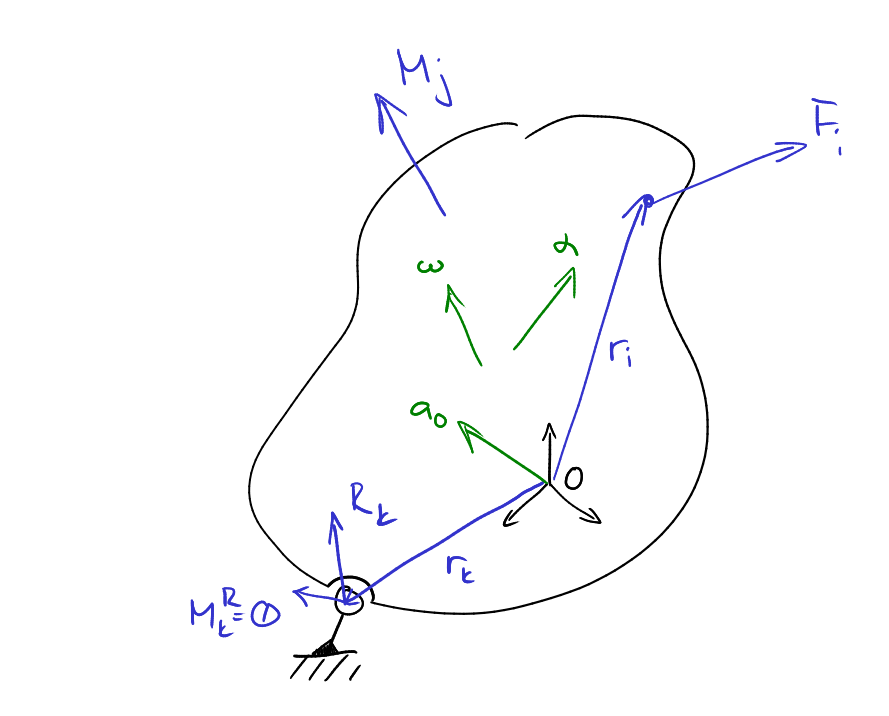

Newton-Eulerovy pohybové rovnice
================================



```math
\begin{aligned}
	m \bm{a}_S &= ∑_i \bm{F}_i
	+ ∑_k \bm{R}_k
	& \text{Newton.}
	\\
	\bm{I}_O \bm{α} + \bm{ω}×\bm{I}_O\bm{ω}
	&=
	∑_i \bm{r}_i×\bm{F}_i + ∑_j \bm{M}_{j}
	+ ∑_k \bm{r}_k×\bm{R}_k + \bm{M}_{k}^R
	& \text{Euler.}	
\end{aligned}
```
kde

* $`m`$ - hmotnost tělesa
* $`\bm{a}_S`$ - zrychlení středu hmotnosti $`S`$
* $`\bm{I}_O`$ - matice setrvačnosti vyjádřená vůči bodu $`O`$
* $`\bm{α}`$ - úhlové zrychlení tělesa
* $`\bm{ω}`$ - úhlová rychlost tělesa
* $`\bm{F}_i`$ - vnější síla
* $`\bm{r}_i`$ - rameno vnější síly
* $`\bm{M}_j`$ - vnější moment (většinou pohony nebo tření v KD)
* $`\bm{R}_k`$ - reakční síla
* $`\bm{r}_k`$ - rameno reakční síly
* $`\bm{M}_k^R`$ - reakční moment

## Uvolňování
Postup kdy je těleso "vyjmuto" a na něj působící kinematické dvojice jsou nahrazeny reakčními silami $`\bm{R}_k`$ a momenty $`\bm{M}_{k}^R`$.